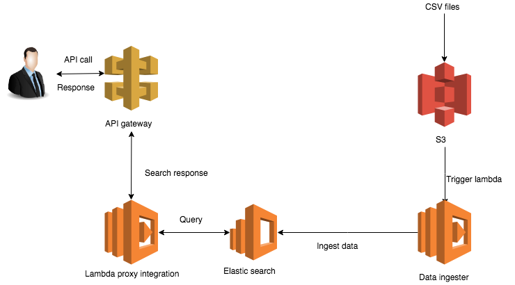

# ElasticSearchPOC
This is a POC for Elastic Search using AWS 

# API example

EndPoint: /v1?q=<search_term>  
Method: GET  
Headers: x-api-key: <api_key>  
Status Code: 200 - Ok, 403 - Forbidden if api key not given  
search_term = could be any string, no results returned if empty or not present  

